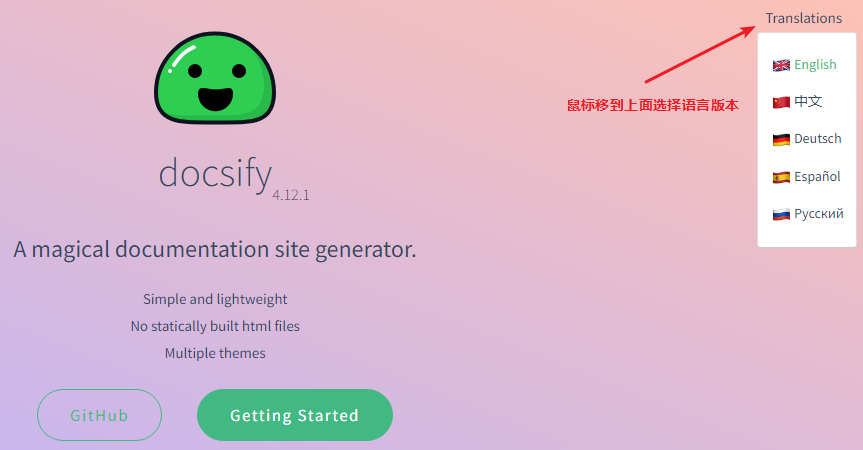

# 搭建成功的案例

鱼皮-编程学习路线：

https://luxian.yupi.icu/#/

https://thinkaboutai.github.io/#/

陌溪的学习笔记：

- 在线文档：<http://note.moguit.cn/>
- 备用地址：<http://moxi159753.gitee.io/learningnotes/>

# docsify官网

https://docsify.js.org/#/




# 快速开始

## 1.全局安装 `docsify-cli` 工具

```bash
npm i docsify-cli -g
```

## 2.初始化项目

新建一个目录作为项目，如F:\\docsifyLearning


如果想在项目的 `./docs` 目录里写文档，直接通过 `init` 初始化项目。

```bash
docsify init ./docs
```

## 3.开始写文档

初始化成功后，可以看到 `./docs` 目录下创建的几个文件。

- index.html 入口文件
- README.md 主页内容渲染
- .nojekyll 用于阻止 GitHub Pages 忽略掉下划线开头的文件

## 4.本地预览

在项目一级（如F:\\docsifyLearning），通过VSCode控制台或dos窗口运行docsify serve 启动一个本地服务器，可以方便地实时预览效果。默认访问地址 http://localhost:3000 。

```
docsify serve docs
```

# 多页文档

## 链接跳转

语法：

```
[]()
```


中括号写展示的内容，小括号中写具体的跳转地址

## 侧边栏

1.入口文件index.html中配置 `loadSidebar` 选项

```html
<!-- index.html -->

<script>
  window.$docsify = {
    loadSidebar: true
  }
</script>
<script src="//cdn.jsdelivr.net/npm/docsify/lib/docsify.min.js"></script>
```

2.创建 `_sidebar.md` 文件

## 显示目录

设置 `subMaxLevel` 配置项，生成目录的最大层级

```
<!-- index.html -->

<script>
  window.$docsify = {
    loadSidebar: true,
    subMaxLevel: 2
  }
</script>
<script src="//cdn.jsdelivr.net/npm/docsify/lib/docsify.min.js"></script>
```

# 定制导航栏


1.配置 loadNavbar: true选项

2.创建_navbar.md文件

# 封面

1.配置coverpage: true选项

2.创建_coverpage.md文件

3.通常封面和首页是同时出现的，当然你也是当封面独立出来通过设置[onlyCover 选项](https://docsify.js.org/#/zh-cn/configuration?id=onlycover)。

# 部署

## 部署到[Github Pages]((https://pages.github.com/))

Github Pages官网入口：<https://pages.github.com/>

1.创建一个仓库


复制仓库的地址，git clone到本地，如F:\docify-learning下面


将docs文件夹复制到F:\docify-learning\jikejiangbei.github.io下面。

可以用VSCode打开项目,VSCode集成了Git插件。VSCode或命令行中将文件推送到仓库中就可以访问了。


## 最终访问路径

https://jikejiangbei.github.io/#/